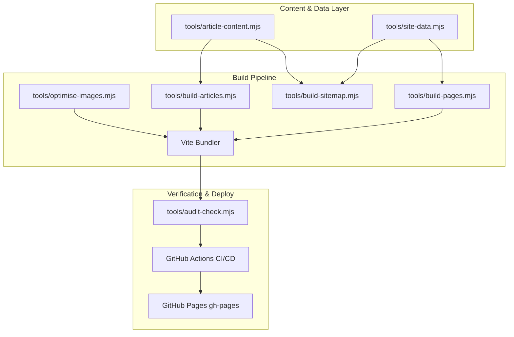

# Mechaura International Web Architecture

Official website and technical catalog for **Mechaura International FZE LLC**, industrial supplier serving the UAE and GCC region (abrasive brushes, shot blast solutions, hydraulic hoses, bearings, bandsaw blades, cutting tools, and industrial filtration).

---

## 🏗️ Architecture Overview

The codebase is built on a **Static-First + Vite Pipeline** architecture designed for maximum SEO crawlability, instant page speeds, zero runtime framework overhead, and automated deployment to GitHub Pages.



### Key Technical Pillars

1. **Pre-rendered HTML**: Hand-crafted core landing pages at root, with programmatic product, pillar, and blog pages compiled from structured data modules (`tools/site-data.mjs` and `tools/article-content.mjs`).
2. **Clean URL Routing**: Built with Vite's Rollup configuration to serve extensionless URLs (`/products/abrasive-brushes`, `/about`, `/services`) both in local development and production.
3. **Structured Data & SEO**: Full Schema.org JSON-LD coverage (Organization, BreadcrumbList, Product, FAQPage, TechArticle, LocalBusiness, OfferCatalog) verified by automated CI audit gates.
4. **Optimized Assets**: Canonical static assets housed under `public/`, with automated WebP conversion and Sharp image compression.

---

## 📁 Directory Structure

```
.
├── .github/                # CI/CD workflows (GitHub Actions deploy to gh-pages)
├── blog/                   # Generated blog/technical article HTML pages
├── products/               # Generated individual product HTML pages
├── public/                 # Static assets served at root / copied to dist
│   ├── assets/             # Core UI illustrations and hero graphics (WebP & PNG)
│   ├── fonts/              # Custom web fonts (Aeonik / Switzer)
│   ├── images/             # Product photography, company logo, schematics
│   │   └── products/       # Branded technical SVG schematics & specification sheets
│   ├── CNAME               # Custom domain config (mechaurainternational.com)
│   ├── robots.txt          # Search engine crawler directives
│   ├── sitemap.xml         # Auto-generated XML sitemap with image metadata
│   └── llms.txt            # Structured markdown data for AI search engines
├── tools/                  # Build, generation, optimization, and audit toolchain
│   ├── archive/            # Historical migration and patch scripts
│   ├── article-content.mjs # Blog articles raw text, headings, and metadata
│   ├── audit-check.mjs     # SEO audit gate checking HTML signals & structured data
│   ├── build-articles.mjs  # Compiles articles into static HTML pages under blog/
│   ├── build-pages.mjs     # Compiles product, location, & pillar landing pages
│   ├── build-sitemap.mjs   # Generates canonical XML sitemap
│   ├── deploy-ghpages.mjs  # GitHub Pages deployment automation script
│   ├── deploy-preview.mjs  # Subpath preview build runner
│   ├── generate-product-media.mjs # Vector SVG schematic generator for products
│   ├── optimise-images.mjs # Sharp-based WebP converter and layout optimizer
│   └── site-data.mjs       # Central data model for products, markets, & company info
├── 404.html                # Custom 404 handler with legacy route resolution
├── about.html              # Company profile & leadership page
├── blog.html               # Articles and insights hub
├── contact.html            # Quotation desk and contact page
├── delivery-policy.html    # Logistics and delivery information
├── index.html              # Main homepage
├── main.js                 # Vanilla JavaScript for navigation, modal, and animations
├── package.json            # Project dependencies and script definitions
├── privacy-policy.html     # Privacy policy & compliance
├── product-detail.html     # Client-side dynamic product viewer fallback
├── products.html           # Main product catalog overview
├── sectors.html            # Industry sectors served (Oil & Gas, Construction, etc.)
├── services.html           # Technical supply services overview
├── style.css               # Core design tokens, typography, layouts, & components
├── terms-conditions.html   # Terms and conditions
└── vite.config.js          # Vite configuration with clean URL build hooks
```

---

## 🚀 Getting Started

### Prerequisites
- **Node.js**: v20 or higher
- **npm**: v10 or higher

### Installation
```bash
# Clone the repository
git clone https://github.com/JohnzzzAntony/New-Mechaura.git
cd New-Mechaura

# Install dependencies
npm install
```

### Development
Start the local Vite development server with clean URL support:
```bash
npm run dev
```

### Build Pipeline
To regenerate all pages, sitemaps, optimize images, and bundle with Vite:
```bash
npm run build
```

The build sequence executes:
1. `tools/build-pages.mjs`: Compiles 8 product pages, 1 shot-blast pillar page, and 3 UAE city landing pages.
2. `tools/build-articles.mjs`: Compiles 6 technical blog articles and updates `blog.html` card links.
3. `tools/build-sitemap.mjs`: Scans all published routes and outputs `public/sitemap.xml`.
4. `tools/optimise-images.mjs`: Compresses images and generates responsive WebP variants.
5. `vite build`: Creates production bundle in `dist/` with clean URL directory rewrites.

### Quality & SEO Audit Check
Run the automated SEO signal and Schema.org validator against the built bundle:
```bash
npm run audit
```

### Regenerate Product Schematics
To regenerate technical vector SVG graphics across all product ranges:
```bash
npm run media
```

---

## 🚢 Deployment

### Automated (Production)
Pushes to the `main` branch automatically trigger the GitHub Actions workflow [`.github/workflows/deploy.yml`](.github/workflows/deploy.yml), which:
1. Installs dependencies and builds the production bundle.
2. Executes `npm run audit` as a mandatory blocking gate.
3. Deploys the verified `dist/` directory to the `gh-pages` branch.

### Manual / Preview Deployment
To publish a preview build under a GitHub Pages subpath:
```bash
npm run deploy:preview
```